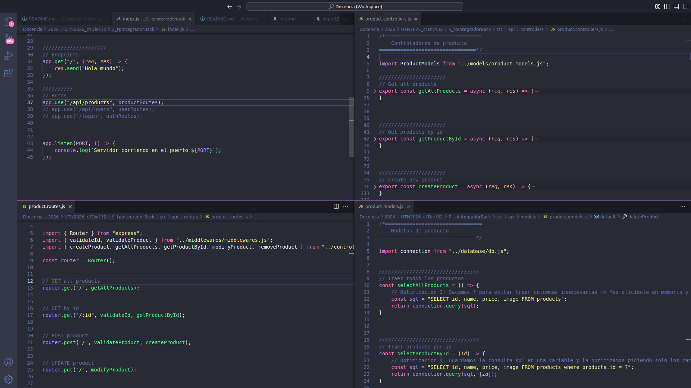

# TP Integrador 2026 c1 Div334 / Backend

# ////////////////////////////////////////////////////
# CRUD version I: *MVC con EJS*
# ////////////////////////////////////////////////////

1. Crear endpoints minimos e consumilos dende o cliente
2. Optimizar endpoints
3. Consumir dende front e crear middlewares
4. Refactorizacion e MVC. Modularizar con router, middlewares, controladores e modelos
5. Setup e renderizado con EJS

---

## 1. Arrancando un servidor minimo

### 1.1 Configuracion inicial del proyecto
Antes de nada, vamos a asegurarnos de que nuestro entorno está preparado y crearemos el proyecto

```sh
# Comprobamos la version de Node.js y NPM
node -v
# v20.5.0

npm -v
# 9.8.0

# Creamos un directorio para nueestro proyecto y navegamos a el
mkdir nombreProyecto_Back
cd nombreProyecto_Back

# Inicializamos el proyecto
npm init -y
```

---

### 1.2 Instalacion de dependencias y setup básico con sintaxis ESM

```sh
# Instalamos las dependencias necesarias, que iran a parar a la carpeta node_modules
npm install express ejs mysql2 nodemon dotenv
```
#### Qué estamos instalando?
- **`express`**: Framework web.
- **`ejs`**: Motor de plantillas.
- **`mysql2`**: Cliente MySQL para Node.js.
- **`nodemon`**: Herramienta que reinicia automáticamente la aplicación Node.js cuando detecta cambios en los archivos durante el desarrollo.
- **`dotenv`**: Módulo que carga variables de entorno desde un archivo .env al entorno de ejecución de Node.js.

#### Nuevo script de arranque y sintaxis ESM
- Agregamos type module en el `package.json`
- Agregamos script `dev`

```json
"type": "module",
"scripts": {
    "dev": "nodemon index.js"
}
```

#### Creamos el archivo principal `index.js` como lo indica el `package.json`
```js
import express from "express";
const app = express();

app.get("/", (req, res) => {
    res.send("Hola mundo!");
});

app.listen(3000, () => {
    console.log(`Servidor corriendo en el puerto 3000`);
});
```

Ahora ejecutamos nuestro servidor con nuestro nuevo script
```sh
npm run dev
```

Listo!


---


## 2. Conectando a una BBDD

---

### 2.0 Necesitamos instalar mysql y phpmyadmin
**Para Windows, usar [xampp](https://www.apachefriends.org/es/index.html)**
#### [Que es xampp?](https://www.polimetro.com/que-es-xampp/)
XAMPP es un entorno de desarrollo local que reúne en un solo paquete todos los componentes necesarios para instalar un servidor web completo en tu propio ordenador, independientemente de si usas Windows, Linux o macOS. Su denominación es un acrónimo que refleja los elementos que lo componen y su naturaleza multiplataforma:

- X: Representa la capacidad multiplataforma (Windows, Linux, macOS).
- A: Hace referencia a Apache, el servidor web líder en la entrega de sitios y aplicaciones.
- M: Alude a MariaDB o MySQL, sistemas de gestión de bases de datos relacionales ampliamente utilizados. Actualmente, XAMPP integra MariaDB como alternativa a MySQL.
- P: Por PHP, el lenguaje de programación más empleado en el desarrollo de aplicaciones web dinámicas.
- P: Indica la inclusión de Perl, otro lenguaje orientado a tareas de administración, scripting y desarrollo web complejo.

Componentes extra: Incluye herramientas complementarias como **phpMyAdmin** (gestión visual de bases de datos), FileZilla (servidor FTP), Mercury (servidor de correo), OpenSSL y otros, dependiendo del sistema operativo.
Software libre: Tanto XAMPP como sus componentes principales son open source, de uso gratuito incluso en entornos comerciales, siempre que se respeten las licencias de cada componente.
Actualizaciones periódicas: La comunidad y los desarrolladores de XAMPP lanzan frecuentemente nuevas versiones con mejoras y actualizaciones de sus módulos principales.

---

### 2.1 Crear archivos `.gitignore` y `.env` en la raiz del proyecto
- `.gitignore` nos permite no enviar a git nuestros paquetes de npm y nuestras variables de entorno
- `.env`sirve para almacenar localmente variables sensibles como el usuario y password de la conexion a la BBDD, el puerto, entre otros datos

#### Dentro de `.gitignore` escribimos 
```
node_modules
.env
```

#### Creamos nuestras variables de entorno en `.env`
Previamente instalamos el paquete dotenv, que sirve para cargar las variables de entorno desde un archivo .env, lo cual es especialmente útil para manejar configuraciones de desarrollo, producción, y otras configuraciones específicas.

```
PORT=3000
DB_HOST="localhost"
DB_NAME="nombreDB"
DB_USER="nombreUser"
DB_PASSWORD="passUser"
```

---

### 2.2 Crear estructura de directorios (carpetas) de nuestro proyecto para almacenar la configuracion de nuestro proyecto y la conexion a la BBDD

- Creamos `src/api/config/environments.js`
```js
// Importamos el modulo dotenv para importar las variables de entorno
import dotenv from "dotenv";

dotenv.config();
//config(); // Cargamos las variables de entorno desde el archivo .env

export default {
    port: process.env.PORT || 3000,
    database: {
        host: process.env.DB_HOST,
        name: process.env.DB_NAME,
        user: process.env.DB_USER,
        password: process.env.DB_PASSWORD
    }
}
```

- Creamos `src/api/database/db.js`
```js
// Importamos el modulo mysql2 en modo promesas, para poder hacer peticiones asincronas a la BBDD
import mysql from "mysql2/promise";

// Importamos la informacion de la conexion a la BBDD
import environments from "../config/environments.js";

// Traemos la informacion del .env que importa y exporta el archivo environments.js
const { database } = environments; 

// Creamos la conexion (un pool de conexiones) a la BBDD
const connection = mysql.createPool({
    host: database.host,
    database: database.name,
    user: database.user,
    password: database.password
});

/*  
- mysql es el módulo.

- createPool(...) es una función que crea un grupo (pool) de conexiones a la base de datos.
    - Crea un gestor de conexiones automático.
    - Se conecta a la base de datos usando los parámetros (host, user, password, etc.).
    - Por defecto, abre hasta 10 conexiones simultáneas (esto es configurable).
    - Permite usar await connection.query(...) para ejecutar SQL.
    - Le pasamos la configuración desde el objeto database.

Este objeto connection va a ser el que uses en otras partes de la aplicación para ejecutar consultas.*/

export default connection; // Exportamos el pool de conexiones para que pueda ser usado en otros archivos
```

#### Qué es un Pool de Conexiones?
Un pool de conexiones es un conjunto de conexiones activas y reutilizables a la base de datos. En lugar de abrir y cerrar una nueva conexión cada vez que haces una consulta, el pool:

- Mantiene abiertas varias conexiones.
- Las reutiliza para distintas consultas.
- El rendimiento y eficiencia del servidor.
- Controla cuántas conexiones pueden usarse al mismo tiempo.

Ventajas del Pool:
- Evita crear y destruir conexiones constantemente.
- Reduce la carga en la base de datos.
- Mejora la velocidad y capacidad de respuesta de la app.


---


### 2.3 Creamos un endpoint minimo para probar la conexion a la BBDD

#### Creamos el endpoint **GET all products** en `index.js`
```js
import express from "express";
import connection from "./src/api/database/db.js"; // Importamos la conexion de nuestra BBDD
import environments from "./src/api/config/environments.js"; // Traemos el puerto del .env

const PORT = environments.port;
const app = express();

app.get("/", (req, res) => {
    res.send("Hola mundo!");
});

// Creamos un endpoint minimo para verificar la conexion a la BBDD
// localhost:3000/products es nuestro endpoint, es decir la URL especifica de nuestra API Rest para obtener un recurso

app.get("/api/products", async (req, res) => { // Nuestra app atenderá peticiones get a la url /products
    try {
        const [rows] = await connection.query("SELECT * FROM products"); // Le pasamos la siguiente consulta SQL
        res.status(200).json({ // La respuesta que nos proporciona el objeto res devolverá el JSON
            payload: rows
        });

    } catch (error) {
        console.error("Error obteniendo productos: ", error.message)
    }
});

app.listen(PORT, () => {
    console.log(`Servidor corriendo en el puerto ${PORT}`);
});
```

---


### 2.4 Incorporamos un front minimo para consumir esa informacion
#### Consumimos el endpoint GET desde el front
```js
// Variables globales
let contenedorProductos = document.querySelector(".contenedor-productos");

async function mostrarProductos() {
    try {
        let respuesta = await fetch("http://localhost:3000/api/products");
        let formato = await respuesta.json();
        let productos = formato.payload;

        renderizarProductos(productos);

    } catch(error) {
        console.error(error);
    }
}

function renderizarProductos(array) {
    let htmlProducto = "";

    array.forEach(producto => {
        htmlProducto += `
            <div class="card-producto">
                
                <h3>${producto.name}</h3>
                <p>Id: ${producto.id}</p>
                <p>$${producto.price}</p>
            </div>
        `;
    });
    
    contenedorProductos.innerHTML = htmlProducto;
}
```

#### Vamos a encontrar un error!

---

### 2.5 Explicacion de CORS y los middlewares
Desde el front hacemos un fetch y encontraremos el siguiente fallo en la consola del navegador

```js
/*
Bloqueouse a solicitude Cross-Origin: a política «Same Origin» impide ler un recurso remoto en http://localhost:3000/api/products. (Razón: falta a cabeceira «Access-Control-Allow-Origin»). Código do estado: 200.
TypeError: NetworkError when attempting to fetch resource.
*/
```
#### Qué es CORS y por qué bloquea API

**CORS (Cross-Origin Resource Sharing)** es un mecanismo de seguridad implementado por los navegadores para restringir las solicitudes HTTP que se realizan desde un dominio diferente al del servidor de destino. Su propósito principal es prevenir ataques maliciosos, evitando que un sitio web malicioso acceda a recursos protegidos (como cookies o tokens de autenticación) de otro sitio sin autorización.

Cuando intentas consumir tu API REST desde una aplicación web alojada en un dominio distinto (por ejemplo, tu frontend en `http://localhost:3000` y tu API en `http://localhost:8080`), el navegador bloquea la solicitud si el servidor de la API no incluye las cabeceras adecuadas de CORS. Esto ocurre porque el **origen** (protocolo, dominio y puerto) de la aplicación cliente no coincide con el del servidor de la API, activando la **política de mismo origen**.

#### ¿Por qué no permite consumir tu API REST?
- El navegador bloquea la solicitud si el servidor no responde con las cabeceras de CORS necesarias.
- El error típico en la consola es: *"No 'Access-Control-Allow-Origin' header is present"*, lo que indica que el servidor no autoriza el acceso desde tu origen.

#### Solución
Para permitir el acceso desde tu frontend, debes configurar tu API REST para que responda con las siguientes cabeceras HTTP:
```http
Access-Control-Allow-Origin: https://tufrontend.com
Access-Control-Allow-Methods: GET, POST, PUT, DELETE
Access-Control-Allow-Headers: Content-Type, Authorization
```
- Usa `*` como valor de `Access-Control-Allow-Origin` solo si la API es pública (no recomendado para APIs con credenciales).
- Para desarrollo local, puedes usar `http://localhost:3000` o `http://localhost:*`.
- En entornos de producción, especifica los dominios exactos permitidos.

#### Ejemplos de implementación:
- **PHP**: Usa `header('Access-Control-Allow-Origin: *');` al inicio del script.
- **Node.js/Express**: Usa el middleware `cors()` o configura manualmente las cabeceras.
- **Spring Boot**: Usa `@CrossOrigin` en el controlador o configura globalmente.
- **API Gateway (AWS, Oracle, Google)**: Activa CORS directamente en la consola o mediante políticas de solicitud.

Sin esta configuración, el navegador **bloqueará cualquier solicitud entre orígenes**, incluso si tu API está funcionando correctamente.

---


### 2.6 Incorporamos Middlewares en nuestra app

#### Que es un Middleware?
Los middlewares en Express son funciones que se ejecutan durante el ciclo de solicitud y respuesta de una aplicación. Estas funciones tienen acceso al objeto de solicitud (req), al objeto de respuesta (res) y a la siguiente función de middleware en el ciclo, que se denota normalmente como next Los middlewares pueden realizar tareas como ejecutar código, modificar los objetos de solicitud y respuesta, finalizar el ciclo de solicitud/respuesta o invocar a la siguiente función de middleware

Además, los middlewares pueden ser de diferentes tipos, como el middleware de nivel de aplicación, que se registra usando app.use() y se aplica a todas las rutas y métodos de una aplicación Express También existen middlewares de nivel de direccionador, que se enlazan a una instancia de express.Router() y se cargan utilizando las funciones router.use() y router.METHOD()


Los middlewares de terceros son funciones desarrolladas por la comunidad y publicadas en npm, que permiten agregar funcionalidades adicionales a las aplicaciones Express, como el análisis de cookies con el módulo cookie-parser Estos middlewares ayudan a separar las preocupaciones y gestionar rutas complejas de manera más eficiente

#### Instalamos cors
```sh
npm install cors
```

#### Hacemos uso de los siguientes middlewares en nuestro `index.js`
```js
//////////////////
// Middlewares //

// 1. Middlewares de aplicacion -> Aplicados a nivel de aplicacion para todas las solicitudes (autenticacion global, registro de solicitudes (logging), analisis del cuerpo de la solicitud (body parsing))

// 1.1 -> Middleware para parsear JSON en las solicitudes POST, PUT
app.use(express.json()); // Middleware para parsear JSON en body (sin el express no parseara la informacion en el body de la peticion y aparecera como undefined)
// It parses requests with a Content-Type header of application/json, storing the resulting data in req.body, making the JSON content easily accessible

// 1.2 -> Middleware CORS basico para permitir las solicitudes
app.use(cors()); // Middleware CORS básico que permite todas las solicitudes

// 1.3 -> Middleware para analizar las solicitudes por la consola
app.use((req, res, next) => {
	console.log(`[${new Date().toISOString()}] ${req.method} ${req.url}`);
	next(); // Pasa al siguiente middleware
});
```

Ahora podremos consumir los datos que proporciona nuestra API Rest desde una aplicacion frontend!


---


## 3. Creamos los endpoints basicos sin optimizar de nuestro CRUD

### 3.0 Conceptos fundamentales

- **GET**: Para obtener datos del servidor. Es lo que usamos para acceder a páginas web o buscar información.
- **POST**: Para enviar datos al servidor. Se usa comúnmente en formularios de registro, login, etc.
- **PUT**: Para actualizar información en el servidor.
- **DELETE**: Para eliminar información.

---

### 3.1 Creamos el endpoint **GET products by id**
```js
// GET product by id
app.get("/api/products/:id", async (req, res) => {

    // Hacer destructuring con const { id } = req.params;
    let id = req.params.id;
    
    // Evitamos consultas vulnerables usando placeholders
    // Ej: `SELECT * FROM products where products.id = ${id}`
    const [rows] = await connection.query("SELECT * FROM products where products.id = ?", [id]);

    res.status(200).json({
        payload: rows
    });
});
```

---

#### Consumimos el endpoint GET by id desde el front
```js
 getProduct_form.addEventListener("submit", async (event) => {

    event.preventDefault(); // Prevenimos el envio por defecto del formulario

    let formData = new FormData(event.target); // Creamos un nuevo objeto FormData a partir de los datos del formulario
    
    let data = Object.fromEntries(formData.entries()); // Transformamos a objetos JS los valores de FormData
    
    let idProd = data.idProd;
    
    try {
        // Hacemos el fetch a la url personalizada
        let response = await fetch(`http://localhost:3000/api/products/${idProd}"`);
        console.log(response);

        // Optimizacion 1 -> Evaluamos si el servidor respondio correctamente
        if(response.ok) {
            // Procesamos los datos que devuelve el servidor
            let datos = await response.json();
            console.log(datos);
            let producto = datos.payload[0];
            console.log(producto);

            // TO DO (pasarlo a function mostrarProducto)
                let htmlProducto = `
                    <li class="li-listados">
                        
                        <p>Id: ${producto.id} / Nombre: ${producto.name} / <strong>Precio: $${producto.price}</strong></p>
                    </li>
                `;

            getId_list.innerHTML = htmlProducto;
        } else {
            alert("Error, TO DO agardar a optimizacion")
        }

    } catch(error) {
        console.log(error);
        console.error("Error al obtener el producto: ", error.message);
    }
});
```

---


### 3.4 Creamos el endpoint **POST product**
```js
app.post("/api/products", async (req, res) => {
    let { category, image, name, price } = req.body;
    
    let sql = "INSERT INTO products (name, image, category, price) VALUES (?, ?, ?, ?)";

    await connection.query(sql, [name, image, category, price]);

    res.status(200).json({
        message: "Producto creado con exito"
    });
});
```

---

#### Consumimos el endpoint POST desde el front
```js
altaProducts_form.addEventListener("submit", async(event) => {

    // Evitamos el envio por defecto del formulario
    event.preventDefault(); 

    // Obtenemos la data del formulario
    let formData = new FormData(event.target);

    console.log(formData); 
    //FormData(4) { category → "food", image → "https://external-content.duckduckgo.com/iu/?u=https%3A%2F%2Fimag.bonviveur.com%2Fempanadas-argentinas-de-carne-foto-cerca.jpg&f=1&nofb=1&ipt=69ae3503efb8b142aabaef1b982c83d57e2633d9046cecb6bb78551d7a782376", name → "Empanada", price → "100" }

    // Transformamos esta data del formulario en un objeto JavaScript
    let data = Object.fromEntries(formData.entries());


    try {
        let response = await fetch("http://localhost:3000/api/products", {
            method: "POST",
            headers: {
                "Content-Type": "application/json",
                // Si necesitaramos tambien podriamos pasar otros parametros adicionales
            },
            body: JSON.stringify(data)
        });

        if(response.ok) {
            console.log(response);

            let result = await response.json();
            console.log(result.message);
            
            alert(result.message);
        }

    } catch (error) {
        console.error("Error al enviar los datos ", error);
        alert("Error al procesar la solicitud");
    }
});
```


---


### 3.5 Creamos el endpoint **PUT product**
```js
app.put("/api/products", async (req, res) => {
    let { id, name, image, price, category } = req.body;

    let sql = `UPDATE products SET name = ?, image = ?, price = ?, category = ? WHERE id = ?`;

    await connection.query(sql, [name, image, price, category, id]);

    return res.status(200).json({
        message: "Producto actualizado correctamente"
    });
});
```

#### Consumimos el endpoint PUT desde el front
```js
getProduct_form.addEventListener("submit", async (event) => {

    event.preventDefault(); // Prevenimos el envio por defecto del formulario

    let formData = new FormData(event.target); // Creamos un nuevo objeto FormData a partir de los datos del formulario
    console.log(formData); // FormData { idProd → "1" }

    let data = Object.fromEntries(formData.entries()); // Transformamos a objetos JS los valores de FormData
    console.log(data); // Object { idProd: "2" }

    let idProd = data.idProd;

    let response = await fetch(`http://localhost:3000/api/products/${idProd}"`);

    let datos = await response.json();

    let producto = datos.payload[0]; // Tenemos el primer resultado del producto

    mostrarProducto(producto)
});


function mostrarProducto(producto) {
    let htmlProducto = `
        <li class="li-listados">
            
            <p>Id: ${producto.id} / Nombre: ${producto.name} / <strong>Precio: $${producto.price}</strong></p>
        </li>
        <li>
            <input type="button" id="updateProduct_button" value="Actualizar producto">
        </li>
    `;

    getId_list.innerHTML = htmlProducto;


    let updateProduct_button = document.getElementById("updateProduct_button");

    updateProduct_button.addEventListener("click", (event) => {
        formularioPutProducto(event, producto);
    });
}


function formularioPutProducto(event, producto) {
    event.stopPropagation();
    console.log(producto); // El producto llega correctamente

    let updateProduct = `
        <div id="updateProducts-container" class="crudForm-container">

            <h2>Actualizar producto</h2>

            <form id="updateProducts-form">

                <label for="idProd">Id</label>
                <input type="number" name="id" id="idProd" value="${producto.id}" readonly>


                <label for="categoryProd">Categoria</label>
                <select name="category" id="categoryProd" required>
                    <option value="food">food</option>
                    <option value="drink">drink</option>
                </select>


                <label for="imageProd">Imagen</label>
                <input type="text" name="image" id="imageProd" value="${producto.image}" required>


                <label for="nameProd">Nombre</label>
                <input type="text" name="name" id="nameProd" value="${producto.name}" required>


                <label for="priceProd">Precio</label>
                <input type="number" name="price" id="priceProd" value="${producto.price}"  required>


                <input type="submit" value="Actualizar producto">
            </form>
        </div>
    `;

    updateFormContainer.innerHTML = updateProduct;

    let updateProducts_form = document.getElementById("updateProducts-form");

    updateProducts_form.addEventListener("submit", (event) => {
        actualizarProducto(event);
    });
}


// Enviamos los datos del formulario al servidor
async function actualizarProducto(event) {
    event.preventDefault();

    let formData = new FormData(event.target);

    let data = Object.fromEntries(formData.entries());

    try {
        let response = await fetch("http://localhost:3000/api/products", {
            method: "PUT",
            headers: {
                "Content-Type": "application/json"
            },
            body: JSON.stringify(data)
        });

        if(response.ok) {
            console.log(response);
            let result = await response.json();

            console.log(result.message);
            alert(result.message);

            // Vaciamos si existiera la lista y el formulario de actualizacion del producto
            getId_list.innerHTML = "";
            updateFormContainer.innerHTML = "";

        } else {
            let error = await response.json();
            console.error("Error: ", error.message);
        }

    } catch (error) {
        console.error("Error al enviar los datos: ", error.message);
        alert("Error al procesar la solicitud");
    }
}
```

---


### 3.6 Creamos el endpoint **DELETE product**
```js
app.delete("/api/products/:id", async (req, res) => {
    let { id } = req.params;

    await connection.query("DELETE FROM products WHERE id = ?", [id]);

    res.status(200).json({
        message: `Product con id ${id} eliminado correctamente`
    });
});
```

---

#### Consumimos el endpoint DELETE desde el front
```js
getProduct_form.addEventListener("submit", async (event) => {

    event.preventDefault(); // Prevenimos el envio por defecto del formulario

    try {
        let formData = new FormData(event.target); // Creamos un nuevo objeto FormData a partir de los datos del formulario

        let data = Object.fromEntries(formData.entries()); // Transformamos a objetos JS los valores de FormData
        let idProd = data.idProd;

        let response = await fetch(`http://localhost:3000/api/products/${idProd}"`);
        let datos = await response.json();
        let producto = datos.payload[0]; // Tenemos el primer resultado del producto

        let htmlProducto = `
        <li class="li-listados">
            
            <p>Id: ${producto.id} / Nombre: ${producto.name} / <strong>Precio: $${producto.price}</strong></p>
        </li>
            <li>
            <input type="button" id="deleteProduct_button" value="Eliminar producto">
        </li>

        `;

        getId_list.innerHTML = htmlProducto;

        // Vamos a asignarle un evento click a nuestro boton "Eliminar producto"
        let deleteProduct_button = document.getElementById("deleteProduct_button");

        deleteProduct_button.addEventListener("click", event => {
            
            event.stopPropagation();

            let confirmacion = confirm("Querés eliminar este producto?");

            if(!confirmacion) {
                alert("Eliminacion cancelada");

            } else {
                eliminarProducto(producto.id);
            }
        });
        

    } catch (error) { // Continuando error que capturamos en la Optimizacion 1
        console.log(error);
        console.error("Error al obtener el producto: ", error.message);
    }

});

// Funcion para eliminar un producto
async function eliminarProducto(id) {
    try {
        let response = await fetch(`http://localhost:3000/api/products/${id}`, {
            method: "DELETE"
        });

        let result = await response.json();

        if(response.ok) {
            alert(result.message);

            // Vaciamos la lista
            getId_list.innerHTML = "";

        } else {
            console.error("Error:", result.message);
            alert("No se pudo eliminar el producto");
        }

    } catch (error) {
        console.error("Error en la solicitud DELETE: ", error);
        alert("Ocurrio un error al eliminar un producto");
    }
}
```


---


# 4. Optimizamos los endpoints
#### Explicacion en `bitacora/1_optimizacionesCrud.md`
Una vez creado un CRUD minimo y rapido, vamos a optimizar tanto los endpoints como las vistas

## 4.1 Optimizando GET
#### Backend
```js
// GET all products
app.get("/api/products", async (req, res) => {
    /* Version sin optimizar
    const rows = await connection.query("SELECT * FROM products");
    res.status(200).json({
        payload: rows[0]
    });*/
    try {
        // Optimizacion 1: Hacer destructuring con [rows]
        // la desestructuración extrae directamente las filas (que es el primer elemento del resultado de la consulta)
        
        // Optimizacion 2, sacamos SELECT * — evita traer columnas innecesarias y es más eficiente en memoria y red
        const sql = "SELECT id, name, price, image FROM prsroducts";
        const [rows] = await connection.query(sql);


        // Optimizacion 3: Respuesta mas limpia con codigo semantico
        if (rows.length === 0) {
            return res.status(404).json({
                message: "No se encontraron productos"
            });
        }

        res.status(200).json({
            total: rows.length, // Optimizacion 4: Metadata util para el frontend, asi el front no tiene que hacer .length por su cuenta
            payload: rows,
        });
        
    } catch (error) {
        console.log("Error obteniendo productos: ", error.message); // Optimizacion 5: error.message en el log evita loguear el stack completo en producttion
        // Ej: Error obteniendo productos:  Table 'tp25_autoservicio.prsoducts' doesn't exist

        // 500 si fallo la conexion a la BBDD, tardo demasiado, la tabla no existe o error de sintaxis
        res.status(500).json({
            error: "Error interno al obtener productos"
        });
    }
});
```

---

#### Frontend
```js
const contenedorProductos = document.getElementById("contenedor-productos");

const urlBase = "http://localhost:3000/api/products";

// Optimizacion 1: Mostramos el mensaje de error visualmente
function mostrarError(message) {
    contenedorProductos.innerHTML = `
        <p class="mensaje mensaje-error">${message}</p>
    `;
}

async function obtenerProductos() {
    try {
        // Gracias a la API fetch, realizo una peticion HTTP GET a mi propia api rest, al endpoint GET /api/products
        const response = await fetch(urlBase);
        console.log(response); // Aca podemos chequear el booleano que vamos a usar en el if abajo

        // Una vez que recibo todo el choclo JSON, lo parseo con response.json()
        const data = await response.json();

        // Los codigos 200 llevan un booleano ok: true (200 OK)
        if (!response.ok) {
            mostrarError(data.message);
            return;
        }
        
        // Extraigo los productos que vienen en la clave payload
        const productos = data.payload;
        console.log(productos);
        
        renderizarProductos(productos);

    } catch (error) {
        console.error(error);
        mostrarError("Error de conexion con el servidor");
    }

}

function renderizarProductos(array) {
    let htmlProductos = "";

    array.forEach(producto => {
        htmlProductos += `
            <div class="card-producto">
                
                <h4>${producto.name}</h4>
                <p>Id: ${producto.id}</p>
                <p>$${producto.price}</p>
            </div>
        `;
    });

    contenedorProductos.innerHTML = htmlProductos;
}

obtenerProductos();
```


---


## 4.2 Optimizando GET by id
#### Backend
Creamos un nuevo middleware para filtrar ids no validos
```js
const validateId = (req, res, next) => {
    const id = Number(req.params.id);

    if (!Number.isInteger(id) || id <= 0) {
        return res.status(400).json({
            error: "El ID debe ser un entero positivo"
        });
    }

    req.id = id;
    next();
}

/*  Esto rechaza correctamente:
        abc
        42abc
        1.5
        -1
        0

    y acepta:

        1
        25
        999

Para una API REST con IDs `AUTO_INCREMENT`, esta versión suele ser la más común y fácil de leer.*/
```

Ahora optimizamos el endpoint
```js
// GET product by id
app.get("/api/products/:id", validateId, async (req, res) => {

    /*  VERSION SIN OPTIMIZAR

    // Hacer destructuring con const { id } = req.params;
    let id = req.params.id;
    
    // Evitamos consultas vulnerables usando placeholders
    // Ej: `SELECT * FROM products where products.id = ${id}`
    const [rows] = await connection.query("SELECT * FROM products where products.id = ?", [id]);

    res.status(200).json({
        payload: rows
    });*/

    try {
        // Optimizacion 0: Usamos placeholders "?" para prevenir ataques de SQL Injection
        let sql = `SELECT id, name, price, image FROM products where id = ?`;
        // Optimizacion 1: req.id ya viene validado y convertido por el middleware, no hace falta req.params.id
        let [rows] = await connection.query(sql, [req.id]); 

        // Optimizacion 2: El codigo correcto para "No encontrado" es 404, no 400
        if(rows.length === 0) {
            return res.status(404).json({
                error: `No se encontro producto con id ${id}`
            });
        }

        res.status(200).json({
            payload: rows // Podreiamos devolver el objeto unicamente, en lugar del array
        });

    } catch (error) {
        console.error(`Error obteniendo producto con id ${id}`, error.message);
        
        res.status(500).json({
            error: "Error interno al obtener un producto por id"
        });
    }
});
```

#### Frontend
```js
const contenedorProductos = document.getElementById("contenedor-productos");
const getProductForm = document.getElementById("getProduct-form");
const urlBase = "http://localhost:3000/api/products";

// Optimizacion 1: Mostramos el mensaje de error visualmente
function mostrarError(message) {
    contenedorProductos.innerHTML = `
        <p class="mensaje mensaje-error">${message}</p>
    `;
}


getProductForm.addEventListener("submit", async event => {
    event.preventDefault(); // Evitamos el envio por defecto de los formularios html

    console.log(event.target); // Apunto al elemento que activo el evento (hago referencia al propio formulario) <form id="getProduct-form">...</form>

    /*
    // Convertimos los datos de nuestro formulario (event.target) en un objeto FormData
    const formData = new FormData(event.target);
    console.log(formData); // FormData { id → "41" }

    // Convertimos este objeto FormData en un objeto normal JavaScript
    // Pasamos de un objeto nativo FormData { id → "41" } a un Object { id: "41" }
    const data = Object.fromEntries(formData.entries());
    console.log(data); // Object { id: "41" }

    const idProd = data.id;
    console.log(idProd); // 41
    */

    // Optimizacion 2: Si hay un solo valor, podemos saltarnos el FormData + Object.fromEntries
    const idProd = event.target.idProd.value.trim();

    // Optimizacion 2: Tambien filtramos en el cliente en caso de que no haya un id valido
    if (!idProd) {
        mostrarError("Ingresá un ID valido");
        return;
    }


    try {
        // Optimizacion 3: Evitamos hardcodear la URL guardandola previamente en una variable
        // Hacemos el fetch a /api/products pasandole el valor del id
        const response = await fetch(`${urlBase}/${idProd}`);

        // Transformamos la informacion JSON del producto en un objeto JS
        const data = await response.json();

        // Optimizacion 4: Evaluamos si el servidor no respondio un ok
        if (!response.ok) {
            mostrarError(data.message);
            return;
        }

        console.log(data.payload[0]); // Aca extraigo directamente el objeto (devuelve un solo objeto en un array de objetos)

        /*  Que trae payload?
        {
            "payload": [
                {
                "id": 41,
                "name": "Fernetazo Chabona",
                "image": "https://pointlaventanita.com/wp-content/uploads/2024/05/chabona.webp",
                "category": "drink",
                "price": "2300.00",
                "active": 1
                }
            ]
        }

        payload: Array(1)
        0: {id: 41, name: 'Fernetazo Chabona', image: 'https://pointlaventanita.com/wp-content/uploads/2024/05/chabona.webp', category: 'drink', price: '2300.00', …}
        */

        // Guardo el objeto en una variable y se la paso a la funcion mostrarProducto para que muestre la url
        const producto = data.payload[0];
        console.log(producto); // {id: 41, name: 'Fernetazo Chabona', image: 'https://pointlaventanita.com/wp-content/uploads/2024/05/chabona.webp', category: 'drink', price: '2300.00', …}
        
        mostrarProducto(producto);
        

    } catch (error) {
        console.error("Errir al obtener el producto: ", error);
        
        mostrarError("error", "Error de conexion con el servidor");
    }
});

function mostrarProducto(producto) {
    console.table(producto); // Recibimos correctamente el producto en esta funcion

    let htmlProducto = `
        <ul>
            <li class="lista-producto">
                
                <p>Id: 41 / Nombre: Fernet Cola Chabona / <strong>Precio: $4200</strong></p>
            </li>
        </ul>
    `;

    contenedorProductos.innerHTML = htmlProducto;
}
```


---


## 4.3 Optimizando DELETE
#### Backend
```js
// DELETE product
app.delete("/api/products/:id", validateId, async (req, res) => {
    
    // Optimizacion 1: Incorporamos manejo de errores con try catch
    try {
        // El middleware ya valida y anexa el id en req.id
        //const id = req.params.id;
        
        const sql = "DELETE FROM products WHERE id = ?";
        
        await connection.query(sql, [req.id]);
        
        res.status(200).json({
            message: `Producto con id ${req.id} eliminado correctamente`
        });
        
    } catch (error) {
        console.log(error);
        
        // Optimizacion 2: Devolvemos errores 500
        res.status(500).json({
            message: "Error interno del servidor al eliminar productos"
        })
    }
})
```

---

#### Frontend
Continuamos con el mismo front que get by id: `consultar.html`. Creamos un nuevo boton y le asignamos un evento
```js
const contenedorProductos = document.getElementById("contenedor-productos");
const getProductForm = document.getElementById("getProduct-form");
const urlBase = "http://localhost:3000/api/products";

// Optimizacion 1: Mostramos el mensaje de exito o error visualmente
function mostrarMensaje(type, message) {
    contenedorProductos.innerHTML = `
        <p class="mensaje mensaje-${type}">${message}</p>
    `;
}

getProductForm.addEventListener("submit", async event => {
    event.preventDefault(); //Evitamos el envio por defecto HTML del formulario

    // Extraemos el id del producto
    const idProd = event.target.idProd.value.trim();

    // Optimizacion 2: Tambien filtramos en el cliente en caso de que no haya un id valido
    if (!idProd) {
        mostrarError("Ingresá un ID valido");
        return;
    }
    
    try {
        // Vamos a hacer el fetch a una URL personalizada
        const response = await fetch(`${urlBase}/${idProd}`);
        console.log(response);

        // Procesamos los datos que devuelve el servidor
        const datos = await response.json();
        console.log(datos);

        // Optimizacion 4: Evaluamos si el servidor no respondio un ok
        if (!response.ok) {
            mostrarMensaje("error", datos.message);
            return;
        }

        const producto = datos.payload[0];

        console.log(producto); 
        /* {
            "id": 41,
            "name": "Fernet Cola Chabona",
            "image": "https://pointlaventanita.com/wp-content/uploads/2024/05/chabona.webp",
            "category": "drink",
            "price": "4300.00",
            "active": 1
        }*/

        renderizarProducto(producto);

    } catch (error) {
        console.error("Error al obtener el producto");

        mostrarMensaje("error", "Error de conexion con el servidor");
    }
});

function renderizarProducto(producto) {
    let htmlProducto = `
    <ul>
        <li class="lista-producto">
            
            <p>Id: ${producto.id} / Nombre: ${producto.name} / <strong>Precio: $${producto.price}</strong></p>
            <input type="button" id="deleteProduct-button" value="Eliminar Producto">
        </li>
    </ul>
    `;

    contenedorProductos.innerHTML = htmlProducto;

    // Otra opcion seria agregando el atributo onclick="nombrefuncion"

    const deleteProductButton = document.getElementById("deleteProduct-button");

    deleteProductButton.addEventListener("click", event => {
        event.stopPropagation();

        const confirmacion = confirm("Querés eliminar este producto?");

        if(!confirmacion) {
            alert("Eliminacion cancelada");
        } else {
            eliminarProducto(producto.id);
        }
    });
}

// Funcion para realizar una operacion delete
async function eliminarProducto(id) {
    try {
        const response = await fetch(`${urlBase}/${id}`, {
            method: "DELETE"
        });

        const result = await response.json();

        if (!response.ok) {
            console.error(result.message);
            mostrarMensaje("error", result.message);
            return;
        }

        mostrarMensaje("exito", result.message);

    } catch (error) {
        console.error("Error en la solicitud DELETE: ", error);
        alert("Ocurrio un error al eliminar un producto");
    }
}
        
```


---


## 4.4 Optimizando POST
#### Backend
Requerimos un middleware para validar la informacion de los campos del producto
```js
// Middleware para validar los campos de un formulario
const categoriasValidas = ["food", "drink"];
const validateProduct = (req, res, next) => {
    
    const { name, image, price, category } = req.body; // Recogemos los datos del body
    const errores = []; // Creamos un array vacio de errores

    // Verificamos los datos de entrada
    if (!name || !image || !category || !price) {
        errores.push("Faltan campos requeridos");
    }

    if (typeof name !== "string" || name.trim().length < 2) {
        errores.push("El nombre debe tener al menos 2 caracteres");
    }

    // El precio lo parsearemos previamente en el cliente
    if (typeof price !== "number" || price <= 0) {
        errores.push("El precio debe ser un numero mayor a 0");
    }

    // No validaremos image porque luego usaremos Multer

    if (!categoriasValidas.includes(category)) {
        errores.push("Categoria invalida");
    }

    // Detectamos si existe algun error en la lista y lo devolvemos en un 400
    if (errores.length > 0) {
        return res.status(400).json({
            message: "Datos invalidos",
            listaErrores: errores
        });
    }

    next(); // Sin el next, no da paso al siguiente middleware o a procesar la respuesta
}
```

Ahora desarrollamos el endpoint

```js
// POST product
app.post("/api/products", validateProduct, async (req, res) => {

    // Optimizacion 1: Agregamos manejo de errores con try catch
    try {
        // Gracias al middleware app.use(express.json()) -> Recibimos un objeto JS ya parseado
        // console.log(req.body);
    
        // Extraemos los valores que vienen en el CUERPO (body) de la peticion http (HTTP Request)
        const { name, image, category, price } = req.body;

        // Optimizacion 3: Sanitizamos los strings antes de insertarlos, para normalizar los datos
        const cleanName = name.trim();

    
        // Los placeholders "?" nos permiten realizar consultas SQL mas seguras (evitan inyeccion SQL)
        const sql = "INSERT INTO products (name, image, category, price) VALUES (?, ?, ?, ?)";

        const [rows] = await connection.query(sql, [cleanName, image, category, price]);
    
        // Optimizacion 5: En lugar de 200 OK, 201 Created
        res.status(201).json({
            message: `Producto creado con exito con id ${rows.insertId}`,
            productId: rows.insertId // Optimizacion 4: Devolvemos info util como el nuevo id creado
        });

    } catch (error) {
        console.log(error);

        // Optimizacion 2: Devolvemos errores 500
        res.status(500).json({
            message: "Error interno del servidor al crear productos"
        })
    }
});
```

---

#### Frontend
```js
/* =========================
    if(response.ok) + else
            vs
    (!response.ok) + return
=============================

En la mayoría de los casos if (!response.ok) + return es mejor. La razón principal es el concepto de early return o cláusula guarda.
    El caso de error se despacha rápido y se "olvida"
    El flujo principal queda sin anidar
    Más fácil de leer cuando hay múltiples validaciones seguidas

La diferencia se nota cuando escala. Con múltiples validaciones el early return mantiene el código plano:*/


const contenedorProductos = document.getElementById("contenedor-productos");
const postProductForm = document.getElementById("postProduct-form");
const urlBase = "http://localhost:3000/api/products";


// Optimizacion 1: Validacion previa de los datos en el cliente
function validarFormulario(data) {
    const errores = [];

    if (!data.name || data.name.trim().length < 2) {
        errores.push("El nombre debe tener al menos 2 caracteres");
    }

    if (!data.price || isNaN(data.price) || Number(data.price) < 0) {
        errores.push("El precio debe ser un numero mayor a 0");
    }

    if (!data.image) {
        errores.push("Debe incluirse una imagen");
    }

    if (!data.category) {
        errores.push("Debe seleccionar una categoria");
    }

    return errores;
}


// Optimizacion 2: Mostramos el mensaje de exito o error visualmente
function mostrarMensaje(type, message) {
    contenedorProductos.innerHTML = `
        <p class="mensaje mensaje-${type}">${message}</p>
    `;
}

function mostrarListaErrores(array) {
    let htmlErrores = "";
    array.forEach(error => {
        htmlErrores+= `<p class="mensaje mensaje-error">${error}</p>`
    });
    contenedorProductos.innerHTML = htmlErrores;
}


// Gestionamos el envio de datos del formlario
postProductForm.addEventListener("submit", async event => {
    event.preventDefault();

    const formData = new FormData(event.target);

    const data = Object.fromEntries(formData.entries());

    // Optimizacion 3: parseamos price antes de enviarlo, porque FormData devuelve todo como strings
    data.price = Number(data.price);

    console.log(data); // {name: 'Panchito', image: 'https://www.gmasivos.com/wp-content/uploads/Para-Blog-4-Panchito.png', category: 'food', price: 300}

    // Optimizacion 4: Llamamos a la fnucion para validar los datos del formulario
    const errores = validarFormulario(data);

    // Si hay errores, mostramos mensaje de error y terminamos aca
    if (errores.length > 0) {
        console.log(errores);
        mostrarListaErrores(errores);
        return;
    }

    
    try {
        const response = await fetch(urlBase, {
            method: "POST",
            headers: {
                "Content-Type": "application/json"
            },
            body: JSON.stringify(data)
        });
        
        console.log(response); // Response {type: 'cors', url: 'http://localhost:3000/api/products', redirected: false, status: 200, ok: true, …}

        // Aca transformare la respuesta JSON que devuelve el endpoint: message: "Producto creado con exito"
        const result = await response.json(); // Aca obtenemos la respuesta parseada que me devuelve el servidor

        // Optimizacion 5: Manejamos respuestas no ok del servidor
        if (!response.ok) {
            
            if (result.listaErrores) {
                mostrarListaErrores(result.listaErrores);
                return;
            }

            mostrarMensaje("error", result.message);
            return;
        }

        // En caso de exito, mostramos los siguientes mensajes
        mostrarMensaje("exito", result.message);
        console.log(result.message);

    } catch (error) {
        console.error("Error al enviar los datos ", error);
        mostrarMensaje("error", "Error al procesar la solicitud")
    }
});
```

---


## 4.5 Optimizando PUT
#### Backend
```js
//////////////////////
// PUT update product
app.put("/api/products", validateProduct, async (req, res) => {

    // Optimizacion 1: Agregamos manejo de errores con try catch
    try {
        const { id, name, image, price, category } = req.body;

        let sql = `UPDATE products SET name = ?, image = ?, price = ?, category = ? WHERE id = ?`;
        
        const [result] = await connection.query(sql, [name, image, price, category, id]);

        // Optimizacion 2: Verificamos si realmente se actualizo algo
        if (result.changedRows === 0) {
            return res.status(404).json({
                message: `No se actualizo el producto`
            })
        }
        
        return res.status(200).json({
            message: "Producto actualizado correctamente"
        });


    } catch (error) {
        console.log(error);

        // Optimizacion 3: Devolvemos errores 500
        res.status(500).json({
            message: "Error interno del servidor al crear productos"
        });
    }
});
```

---

#### Frontend
```js
const contenedorProductos = document.getElementById("contenedor-productos");
const getProductForm = document.getElementById("getProduct-form");
const contenedorForm = document.getElementById("contenedor-form");
const urlBase = "http://localhost:3000/api/products";

// Optimizacion 1: Mostramos el mensaje de exito o error visualmente
function mostrarMensaje(type, message) {
    contenedorProductos.innerHTML = `
        <p class="mensaje mensaje-${type}">${message}</p>
    `;
}

function mostrarListaErrores(array) {
    let htmlErrores = "";
    array.forEach(error => {
        htmlErrores+= `<p class="mensaje mensaje-error">${error}</p>`
    });
    contenedorForm.innerHTML = htmlErrores;
}

getProductForm.addEventListener("submit", async event => {
    event.preventDefault(); //Evitamos el envio por defecto HTML del formulario

    // Extraemos el id del producto
    const idProd = event.target.idProd.value.trim();

    // Optimizacion 2: Tambien filtramos en el cliente en caso de que no haya un id valido
    if (!idProd) {
        mostrarMensaje("error", "Ingresá un ID valido");
        return;
    }
    
    try {
        // Vamos a hacer el fetch a una URL personalizada
        const response = await fetch(`${urlBase}/${idProd}`);
        console.log(response);

        // Procesamos los datos que devuelve el servidor
        const datos = await response.json();

            // Optimizacion 4: Evaluamos si el servidor no respondio un ok
            if (!response.ok) {
            mostrarMensaje("error", datos.message);
            return;
        }
        console.log(datos);

        

        const producto = datos.payload[0];

        console.log(producto); 
        /* {
            "id": 41,
            "name": "Fernet Cola Chabona",
            "image": "https://pointlaventanita.com/wp-content/uploads/2024/05/chabona.webp",
            "category": "drink",
            "price": "4300.00",
            "active": 1
        }*/

        renderizarProducto(producto);

    } catch (error) {
        console.error("error", "Error al obtener el producto");

        mostrarMensaje("error", "Error de conexion con el servidor");
    }
});

function renderizarProducto(producto) {
    let htmlProducto = `
    <ul>
        <li class="lista-producto">
            
            <p>Id: ${producto.id} / Nombre: ${producto.name} / <strong>Precio: $${producto.price}</strong></p>
            <input type="button" id="updateProduct-button" value="Actualizar Producto">
        </li>
    </ul>
    `;

    contenedorProductos.innerHTML = htmlProducto;

    const deleteProductButton = document.getElementById("updateProduct-button");

    deleteProductButton.addEventListener("click", event => {
        event.stopPropagation();

        const confirmacion = confirm("Querés actualizar este producto?");
        console.log(confirmacion);

        if(!confirmacion) {
            alert("Eliminacion cancelada");
        } else {
            crearFormularioPut(event, producto);
        }
    });
}

// Funcion para realizar una operacion delete
async function crearFormularioPut(event, producto) {

    event.stopPropagation();
    console.table(producto);

    let updateFormHTML = `
        <hr>
        <form id="updateProduct-form" class="form-alta">
            <input type="hidden" name="id" value="${producto.id}">

            <label for="nameProd">Nombre</label>
            <input type="text" name="name" id="nameProd" value="${producto.name}" required>

            <label for="imageProd">Imagen</label>
            <input type="text" name="image" id="imageProd" value="${producto.image}" required>

            <label for="categoryProd">Categoria</label>
            <select name="category" id="categoryProd" required>
                <option value="food">comida</option>
                <option value="drink">bebida</option>
            </select>

            <label for="priceProd">Precio</label>
            <input type="number" name="price" id="priceProd" value="${producto.price}" required>

            <!-- Aca podemos hacer la baja logica que pide el TP -->
            <label for="activeProd">Activo</label>
            <select name="active" id="activeProd">
                <option value="1">activo</option>
                <option value="0">inactivo</option>
            </select>
            
            <div>
                <input type="submit" value="Actualizar producto">
            </div>
        </form>
    `;

    contenedorForm.innerHTML = updateFormHTML;

    const updateProductForm = document.getElementById("updateProduct-form");

    // Capturamos el evento de envio de nuestro nuevo formulario creado dinamicamente
    updateProductForm.addEventListener("submit", event => {
        actualizarProducto(event); // Hacemos la llamada para enviar estos datos
    });
}

// Enviaremos los datos del formulario al servidor
async function actualizarProducto(event) {
    event.preventDefault(); // Evitamos el envio por defecto del formulario

    // Recogemos los datos del formulario en un objeto FormData (no podemos hacerle JSON.stringify())
    const formData = new FormData(event.target); 

    // Parseamos este objeto FormData a un objeto JS para poder enviarlo como JSON con JSON.stringify() en el cuerpo de la peticion
    const data = Object.fromEntries(formData.entries()); 

        // Optimizacion 3: parseamos price antes de enviarlo, porque FormData devuelve todo como strings
        data.price = Number(data.price);

    try {
        const response = await fetch("http://localhost:3000/api/products/",{
            method: "PUT",
            headers: {
                "Content-Type": "application/json"
            },
            body: JSON.stringify(data)
        });

        console.log(response);

        const result = await response.json();
        console.log(result);

        // Optimizacion : Manejamos una respuesta no ok del servidor
        if (!response.ok) {

            console.log(`Lista de errores: \n ${result.listaErrores.length}`);
            contenedorForm.innerHTML = "";
            // TO DO: Crear mostrarListaErrores
            if (result.listaErrores) {
                mostrarListaErrores(result.listaErrores);
            }
            mostrarMensaje("error", result.message);
            console.log(result);
            result.listaErrores.forEach(error => {
                console.log(error);
            })
            console.log(result.listaErrores)
            return;

        }

        getProductForm.innerHTML = "";
        contenedorForm.innerHTML = "";
        mostrarMensaje("exito", result.message);
        console.log(result.message);

    } catch (error) {
        console.error(error);
    }
}

```


---


# 5. Resumen MVC (Modelo Vista Controlador)
- Mas info en `5_tpIntegradorBack/bitacora/`!

## Entendiendo refactorizacion y modularizacion
La **refactorización** es el proceso de mejorar la estructura interna del código sin alterar su comportamiento externo, mientras que la **modularización** implica dividir el código en unidades independientes y cohesivas para mejorar la organización. En el contexto de **Express**, esto significa extraer rutas, modelos y configuraciones de un archivo único (como `index.js`) a archivos separados, previniendo el crecimiento desordenado y facilitando el mantenimiento.

## Patron MVC
El **patrón MVC** (Modelo-Vista-Controlador) es una arquitectura de software que organiza una aplicación separando sus responsabilidades en tres componentes interconectados pero independientes. Su objetivo principal es desacoplar la lógica de negocio de la interfaz de usuario y la gestión de eventos, facilitando el mantenimiento y la escalabilidad del código.

Los tres componentes fundamentales son:

*   **Modelo (Model)**: Gestiona los datos y la lógica de negocio de la aplicación. Es responsable de recuperar, validar y persistir la información (por ejemplo, interactuando con una base de datos), sin conocer cómo se mostrarán esos datos.
*   **Vista (View)**: Se encarga de la presentación y la interfaz de usuario. Muestra la información proporcionada por el modelo en un formato legible (como HTML o JSON) y captura las interacciones del usuario, pero no procesa la lógica de los datos.
*   **Controlador (Controller)**: Actúa como intermediario. Recibe las entradas del usuario (peticiones HTTP), interactúa con el modelo para obtener o modificar datos y selecciona la vista adecuada para renderizar la respuesta.

## Pasos en la refactorizacion de nuestra app
1. Desacoplar los middlewares, los movimos del `index.js` a `middlewares/middlewares.js`

2. Creamos `/routes/product.routes.js` y hicimos que el index redirigiera las peticiones a las rutas. **El index redirige a las rutas de producto**
```js
app.use("/api/products", productRoutes);
```


3. Sacamos el callback de peticiones y respuestas y la enviamos a `/controllers/product.controllers.js`. **Las rutas de producto llaman a los middlewares y al controlador**

4. Sacamos la conexion a la BBDD de los controladores y la enviamos a `/models/product.models.js`. **El controlador de producto llama a el modelo de producto**




---


# 6. Funcionalidad Login
Un login se compone de una vista, un `<form>` y un endpoint que recibe los datos de ese formulario y los procesa, por tanto crearemos

    1. Una vista `login.ejs`
    2. Un controlador que renderice esa vista `auth.controllers.js`
    3. Un modelo para llamar a los usuarios admin de nuestra tabla `user.models.js`
    4. 

## 6.1  ¿Qué es `express-session`?
Sin sesiones **no hay forma de saber si el usuario está logueado**, a menos que uses *tokens* (JWT), cookies firmadas, o algún otro sistema.

Por eso existe `express-session`.

#### Instalar [express-session](https://www.npmjs.com/package/express-session)
```sh
npm i express-session
```

`express-session` es un *middleware* que permite que Express recuerde datos entre peticiones.
Como HTTP es **sin estado**, Express **no sabe quienes somos** entre una ruta y otra.


---


## 6.2 Crearemos una clave de sesion
#### ¿Qué es la `SESSION_KEY` / `SESSION_SECRET`?
Es una **clave privada** que Express usa para **firmar la cookie de sesión**.
Sirve para evitar que alguien:

* falsifique una sesión
* la modifique
* robe una identidad

Ejemplo típico en `.env`:

```
SESSION_SECRET=miClaveSuperSegura123
```

Esto permite que Express cree una cookie segura:

```js
app.use(
  session({
    secret: process.env.SESSION_SECRET,
    resave: false,
    saveUninitialized: false
  })
);
```

#### ¿Por qué debe estar en `.env`?

* Para que no quede expuesta en el repo.
* Porque en producción debe ser larga, compleja y secreta.
* Porque si la alguien roba → puede falsificar sesiones.


### Creamos una clave con un [Generador de claves para session](https://secretkeygen.vercel.app/)


---


## 6.3 Creamos el middleware de `session` para generar sesiones
- Guardamos esta clave en el `.env`
```txt
SESSION_KEY="6ae7227f5e"
```

- `environments.js`
Importamos esta clave en el `environments.js`
```js
session_key: process.env.SESSION_KEY
```

- Usamos el middleware de session no `index.js`
```js
// PASO 1: Importamos express-session
import session from "express-session";

// Hacemos destructuring de port y de session_key de enviroonments
const { port, session_key } = environments;

// Paso 2: Middleware de sesion
app.use(session({
    secret: session_key, // Firma las cookies para evitar manipulación. **¡Debe ser aleatoria y secreta!**
    resave: false, // Evita guardar la sesion si no hubo cambios
    saveUninitialized: true // No guarda sesiones vacias
}));

// Paso 3: Middleware para parsear info de <form>
app.use(express.urlencoded({ extended: true })); // // Middleware necesario para leer formularios HTML <form method="POST">

```


---


## 6.4 Creamos el middleware `requireLogin` para proteger las rutas de nuestras vistas
- En `middlewares.js`
```js
// Middleware simple de proteccion de rutas
const requireLogin = (req, res, next) => {
    if (!req.session.user) {
        return res.redirect("/login")
    }

    next();
}
```

---

- En `view.routes.js`
```js
router.get("/index", requireLogin, indexView);

router.get("/consultar", requireLogin, getView);

router.get("/crear", requireLogin, postView);

router.get("/modificar", requireLogin, putView);

router.get("/eliminar", requireLogin, deleteView)
```


---


## 6.5 Creamos la vista del formulario de login, `login.ejs`
```html
<%- include("partials/head.ejs") %>

<h2><%= about %></h2>

<!--=====================================================
    Enviando formularios de manera nativa con HTML
=========================================================

en action="" mandamos la url del endpoint /login

en method="" determinamos si enviamos con GET o con POST la informacion

Gracias al middleware

    app.use(express.urlencoded({
        extended: true
    }));

Nuestro endpoint recibira esta informacion (No JSON) como objetos JS
Es decir, el middleware parseara automaticamente el tipo de info que envia el <form>

-->

<form id="loginForm" class="form-alta" action="/login" method="POST">

    <!-- TO DO, introducir campos REGEX para validar los datos que enviamos -->
    <label for="emailUser">Email</label>
    <input type="email" name="email" id="emailUser" value="johnny@melavo.com" required>

    <label for="passwordUser">Password</label>
    <input type="password" name="password" id="passwordUser" value="melavo" required>

    <div>
        <input type="submit" value="Login">
    </div>
</form>


<!-- Mostramos posible mensaje de error del endpoint -->
<% if(typeof error !== "undefined") { %> 

        <p class="mensaje mensaje-error"><%= error %></p>

<% } %>


<!-- Nuestro footer, a falta de completarlo solo contiene los cierres del body y el html -->
<%- include("partials/footer.ejs") %>
```


---


## 6.6 Creamos el endpoint POST para iniciar sesion con el login y el email
```js
app.post("/login", async (req, res) => {

    try {
        // Recibimos el email y el password del cuerpo de la peticion 
        const { email, password } = req.body;

        // Evitamos consulta innecesaria
        if(!email || !password) {
            return res.render("login", {
                // Le mandamos a la vista el mensaje de error
                error: "Tódolos campos son obrigatorios"
        }
    
        const sql = "SELECT * FROM usuarios where email = ? AND password = ?";
        let [rows] = await connection.query(sql, [email, password]);
    
        if(rows.length === 0)  {
            return res.render("login", { 
                // La plantilla puede acceder al error
                error: "Credenciais incorrectas"
            })
        }

        const user = rows[0];
        console.table(user);
    
        // Guardamos sesion
        req.session.user = {
            id: user.id,
            nombre: user.nombre,
            email: user.email
        }
     
        res.redirect("/dashboard");

    } catch (error) {
        console.error("Error en el login: ", error);
        res.status(500).json({
            error: "Erro interno del servidor"
        })
    }
});
```


---


## 6.7 Creamos la vista del boton logout dentro del nav
Una vez que accedamos al dashboard, despues de un login exitoso y nos manejemos en nuestras vistas privadas, tendremos que tener la capacidad de cerrar la sesion

Crearemos el boton en el nav de nuestras vistas para salir de la sesion eixstente
- En `nav.ejs`
```html
<form action="/login/destroy" method="POST">
    <input class="btn-logout links-header" type="submit" value="Cerrar sesion">
</form>
```


---


## 6.8 Crearemos el endpoint para destruir la sesion
```js
// Ruta para pechar sesion (destruir sesion e redireccionar)
app.post("/login/destroy", (req, res) => {
    req.session.destroy((err) => { // Destruir la sesion
        if(err) {
            console.error("Erro al destruir a sesion: ", err);
            return res.status(500).json({
                error: "Erro al pechar sesion"
            })
        }
        res.redirect("/login"); // Redirixir a la página de login luego de cerrar la sesión
    })
})
```


---

# 7. Agregamos `bcrypt` para hashear las contraseñas
### Que es hashear una contraseña?
El **hash de contraseña** es el proceso de convertir una contraseña en texto plano mediante un **algoritmo criptográfico unidireccional** para generar una cadena de caracteres de longitud fija y única, conocida como hash. Este mecanismo es fundamental en la ciberseguridad porque **no es reversible**, lo que significa que, a diferencia del cifrado, no existe una clave para descifrar el hash y recuperar la contraseña original.

Cuando un usuario se registra, el sistema almacena únicamente este valor hash en la base de datos. Durante el inicio de sesión, el sistema vuelve a aplicar el algoritmo hash a la contraseña ingresada y compara el resultado con el almacenado; si coinciden, se concede el acceso. Esta práctica asegura que, incluso si una base de datos es comprometida, los atacantes no obtienen las contraseñas reales, sino solo cadenas ilegibles que requieren costosos procesos de fuerza bruta o ataques de diccionario para intentar descifrar.


## 7.1 Creamos usuarios admin agregando un nuevo formulario de creacion de usuarios en la vista `post.ejs`

```html
<div class="form-container">
    <h2>Crear usuario</h2>
    
    <form id="postUser-form" class="form-alta">

        <!-- Nombre de usuario -->
        <label for="nameUser">Nombre</label>
        <input type="text" name="nameUser" id="nameUser" required>

        <!-- Email de usuario -->
        <label for="emailUser">Email</label>
        <input type="email" name="emailUser" id="emailUser" required>                    
        
        <!-- Password de usuario -->
        <label for="passUser">Password</label>
        <input type="text" name="passUser" id="passUser" required>

        <div>
            <input type="submit" value="Crear usuario">
        </div>

    </form>

</div>
```

Agregamos JavaScript para enviar esos datos al servidor en `post.js`
```js
//////////////////////
// Enviando usuario
postUserForm.addEventListener("submit", async event => {
    event.preventDefault(); // Evitamos el envio por defecto del formulario

    // Obtenemos la data del formulario
    const formData = new FormData(event.target);

    // Convertimos nuestro objeto formdata en un objeto literal de JavaScript
    const data = Object.fromEntries(formData.entries());
    console.table(data);

    const jsonData = JSON.stringify(data);
    console.log(jsonData);

    try {
        
        const response = await fetch("http://localhost:3000/api/users/", {
            method: "POST",
            headers: {
                "Content-Type": "application/json"
            },
            body: jsonData
        });

        console.log(response);
        const result = await response.json();

        if (!response.ok) {
            mostrarMensaje("error", result.message);
            return;
        }

        // Mostramos el mensaje de exito y reseteamos el form
        const infoUser = `${result.message} con id ${result.userId}`
        mostrarMensaje("exito", infoUser)
        console.log(infoUser);

        event.target.reset();

    } catch (error) {
        console.error("Error al enviar los datos: ", error);
    }

});
```


---


## 7.2 Instalamos bcrypt y creamos el endpoint que reciba este nuevo usuario con su contraseña hasheada

#### Instalamos [bcrypt](https://www.npmjs.com/package/bcrypt)
```sh
npm i bcrypt
```

### 7.2.1 Derivamos desde el `index.js` todas las consultas a `/api/users` a la rutas del usuario
```js
app.use("/api/users", userRoutes); // Rutas de usuario
```


---


### 7.2.2 Creamos las rutas de usuario `/routes/user.routes.js`
```js
/*========================
    Rutas de usuario
========================*/

import { Router } from "express";
import { createAdminUser } from "../controllers/user.controllers.js";
const router = Router();

// POST product
router.post("/", createAdminUser);


// Exportamos todas las rutas y las centralizamos en el archivo de barril -> index.js
export default router;
```

Y las exportamos al archivo de barril `router/index.js`
```js
/*========================
    Archivo de barril
========================*/
// Centralizamos en este archivo "de barril" todas las rutas y las exportamos con un nombre
import productRoutes from "./product.routes.js";
import viewRoutes from "./view.routes.js";
import authRoutes from "./auth.routes.js"
import userRoutes from "./user.routes.js"

// Archivo de barril que contiene todas las rutas
export {
    productRoutes,
    viewRoutes,
    authRoutes,
    userRoutes
}
```


---


### 7.2.3 Creamos el controlador de usuarios `/controllers/user.controllers.js`

- **Es acá donde importamos bcrypt y hasheamos el password enviado por el formulario a `/api/users` con el metodo `bcrypt.hash()`**
```js
/*================================
    Controladores de usuario
================================*/

import userModels from "../models/user.models.js";
import bcrypt from "bcrypt";

//////////////////////
// Create new product
export const createAdminUser = async (req, res) => {

    try {
        // Recogemos los datos limpios del body
        const { nameUser, emailUser, passUser } = req.body;

        // Bcrypt 1 -> Vamos a hashear el nuevo password del user admin
        const saltRounds = 10;
        const hashedPassword = await bcrypt.hash(passUser, saltRounds);

        const [rows] = await userModels.insertAdminUser(nameUser, emailUser, hashedPassword);
        
        // Optimizacion 4: En lugar de 201, devolvemos un 201 "Created"
        res.status(201).json({
            message: `Usuario creado con exito`,
            userId: rows.insertId
        });

    } catch (error) {
        console.log(error);

        // Optimizacion 5: Devolvemos un codigo de estado 500
        res.status(500).json({
            message: "Error interno del servidor"
        });
    }
}
```

---


### 7.2.4 Creamos el modelo de usuarios en `/models/user.models.js`
```js
/*================================
    Modelos de usuario
================================*/

import connection from "../database/db.js";


/////////////////////////////////
// Crear producto
const insertAdminUser = (name, email, password) => {
    const sql = "INSERT INTO users (name, email, password) VALUES (?, ?, ?)";
    
    // Optimizacion 3: Devolvemos la respuesta en un rows para devolver info util como el id asignado al nuevo producto
    return connection.query(sql, [name, email, password]);
}

export default {
    insertAdminUser
}
```

---


### 7.2.5 Ahora en el controlador de autenticacion `/controllers/auth.controllers.js` comparamos si el hash del password que se envio coincide con el hash de la base de datos

```js
/////////////////////////////////
// Procesamos los datos del login del <form>
export const processLoginInfo = async (req, res) => {

    try {
        // Recibimos los datos de los campos email y password
        // Estos datos, gracias al middleware de parseo de urlencoded ya entran a este endpoint como objetos JS
        const { email, password } = req.body;

        // Evitamos una consulta innecesaria
        if(!email || !password) {
            return res.render("login", {
                title: "Login",
                about: "Introduci tus credenciales",
                error: "Faltan campos en el formulario"
            });            
        }


        /*
        // TO DO, Crearemos el modelo de usuarios
        const sql = "SELECT * FROM users where email = ? AND password = ?";
        const [rows] = await connection.query(sql, [email, password]);
        */

        // Bcrypt 1 -> Traemos solamente el usuario por su email
        const sql = "SELECT * FROM users where email = ?";
        const [rows] = await connection.query(sql, [email]);

        // TO DO, mensaje de error si no existe el usuario admin
        if (rows.length === 0) {
            return res.render("login", {
                title: "Login",
                about: "Introduci tus credenciales",
                error: "No existe el usuario"
            });   
        }

        // Guardamos el usuario que recibimos en la variable rows
        // id, name, email, password

        const user = rows[0];
        console.table(user);

        // Bcrypt 2 -> Comparamos si el hasheo de este password es igual al hasheo de la BBDD
        const match = await bcrypt.compare(password, user.password);
        console.log(match);

        // Bcrypt 3 -> Si coinciden los hashes, match devuelve true y continuamos con el login
        if (match) {
            // Una vez que recibimos a nuestro usuario admin, vamos a creada una sesion
            req.session.user = {
                id: user.id,
                name: user.name,
                email: user.email
            }
    
            // Ya con la nueva sesion creada, redirigimos al dashboard
            res.redirect("/dashboard/index");

        } else {
            return res.render("login", {
                title: "Login",
                about: "Introduci tus credenciales",
                error: "Password invalido"
            });
        }


    } catch (error) {
        console.log(error);
    }
}
```

Listo!